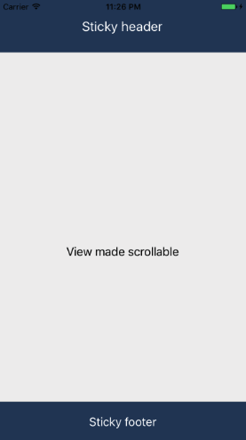

# react-native-sticky-header-footer-scroll-view

A `<StickyHeaderFooterScrollView>` wrapper that

- Takes any component and make it scrollable
- Takes a header/footer and makes it sticky
- Works on iOS and Android

## Add it to your project

iOS and Android

`yarn add react-native-sticky-header-footer-scroll-view`

or

`npm install react-native-sticky-header-footer-scroll-view --save`

Then:

- Whenever you want to use it within React code you can:

`import StickyHeaderFooterScrollView from 'react-native-sticky-header-footer-scroll-view';`

## Demo



## Basic Usage

```
import StickyHeaderFooterScrollView from 'react-native-sticky-header-footer-scroll-view';

//Inside of a component's render() method:
render() {
  return (
    <StickyHeaderFooterScrollView
      renderStickyHeader={() => (
        <View style={...}>
          <Text>{`I'm a sticky header`}</Text>
        </View>
      )}
      renderStickyFooter={() => (
        <View style={...}>
          <Text>{`I'm a sticky footer`}</Text>
        </View>
      )}
    >
      <View style={{ height: 1200, backgroundColor: '#eee' }}>
        <Text>View made scrollable</Text>
      </View>
    </StickyHeaderFooterScrollView>
  )
}
```

| Prop | Description | Default |
|---|---|---|
|**`renderStickyHeader`**|A renderable function for the sticky header. |`null`|
|**`renderStickyFooter`**|A renderable function for the sticky footer. |`null`|
|**`contentBackgroundColor`**|Background color of the main component. |`transparent`|
|**`contentContainerStyle`**|Any style prop to pass to the body. |`null`|

## Example

`cd example/StickyHeaderFooter`

`yarn`

`npm start`

`react-native run-ios` or `react-native run-android`

## Latest changes

### 2.0.4

- Fixes an issue with footer spacer
- Fixes a bug in the example
